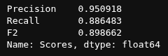

# Transfer Learning for Drone Detection using Faster R-CNN

Object detection model for identifying drones in images, built by fine-tuning a pretrained Faster R-CNN via transfer learning. Final project for a college Deep Learning course.

## Overview

This project applies transfer learning to a Faster R-CNN backbone to detect drones in images. Instead of training from scratch, a pretrained model is fine-tuned on a drone-specific dataset, reducing training time and data requirements while achieving strong detection performance.

## Training & Evaluation

Loss, validation mAP, and learning rate schedule over training:


Confusion matrix on the test set:


Precision, recall, and F2 score:



## Detection Results


## Contents

- `notebook.ipynb` — full pipeline: data loading, model setup, fine-tuning, evaluation, and inference visualization.

## Approach

1. **Base model**: Faster R-CNN pretrained on COCO.
2. **Transfer learning**: backbone frozen/partially fine-tuned; detection head retrained on drone images.
3. **Training**: fine-tuned on labeled drone bounding-box data.
4. **Evaluation**: inference run on test images, results visualized with predicted bounding boxes (see graphs and results above).

## Requirements

- Python 3.x
- PyTorch
- torchvision
- Jupyter Notebook

Install with:
```bash
pip install torch torchvision jupyter
```

## Usage

```bash
git clone https://github.com/OfirTzrik/Transfer-learning-for-drone-detection-using-Faster-R-CNN.git
cd Transfer-learning-for-drone-detection-using-Faster-R-CNN
jupyter notebook notebook.ipynb
```

Run the notebook cells in order to reproduce training and inference.

## Datasets

- Main: [drone-detection-dataset](https://huggingface.co/datasets/pathikg/drone-detection-dataset)
- Negatives: [FGVC-Aircraft](https://huggingface.co/datasets/Voxel51/FGVC-Aircraft), [CUB-200](https://huggingface.co/datasets/cassiekang/cub200_dataset)
It would be better to train with better negatives but these are the best we found in the time constraints we had and we couldn't take any other large dataset due to hardware constraints.

## Disclaimer

This is a college course project, not a production-ready system. Dataset size and diversity are limited, negative-class data is suboptimal (see note above), and performance hasn't been validated outside this dataset's distribution. Use accordingly.
