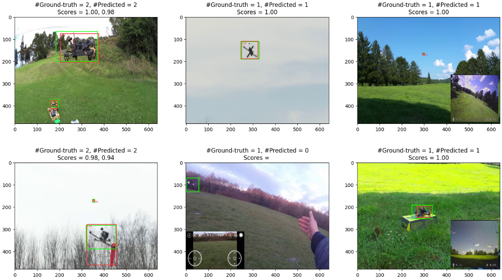
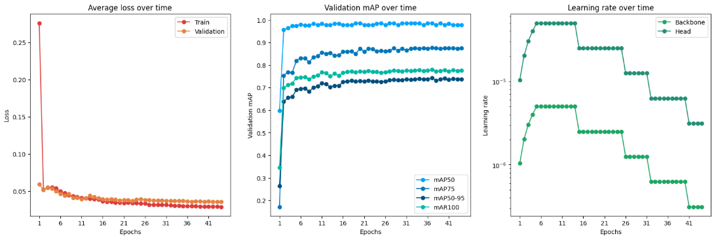
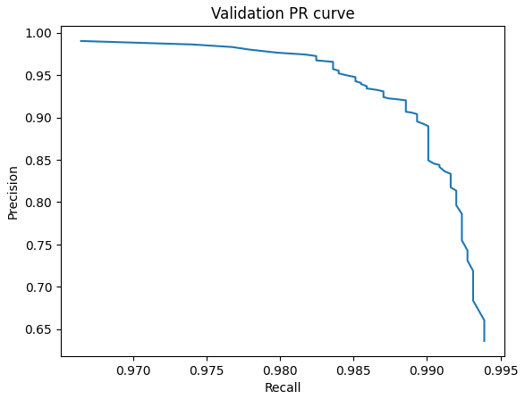
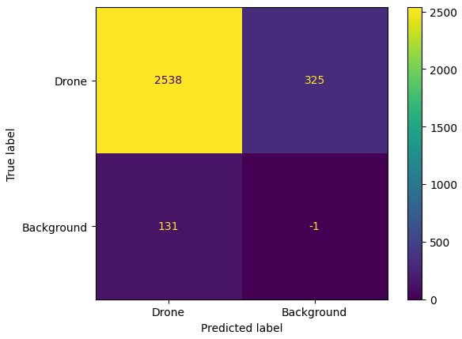
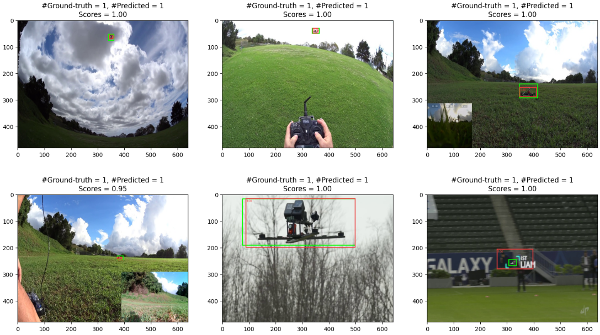
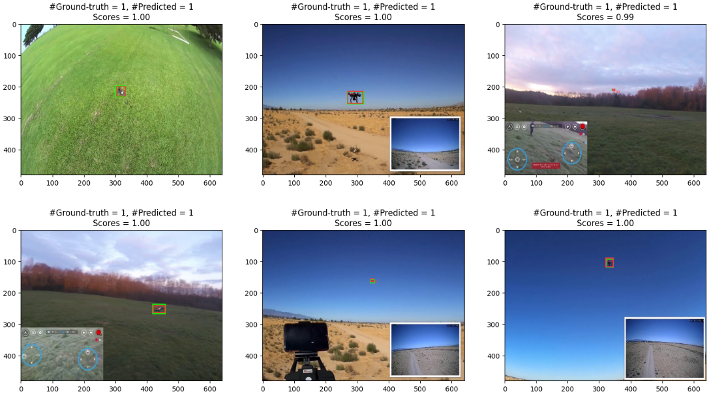

# Transfer Learning for Drone Detection using Faster R-CNN

Fine-tuning a COCO-pretrained Faster R-CNN (ResNet-50 FPN) to detect drones in images, with anchor boxes re-scaled for small objects, aircraft/bird images injected as hard negatives, and a confidence threshold selected on validation by maximizing F2 (recall-weighted).

Final project for a college Deep Learning course. Trained locally on an AMD RX 6750 XT (ROCm).



## Results

Test set, at the validation-selected confidence threshold:

| Metric | Score |
|---|---|
| Precision | 0.951 |
| Recall | 0.886 |
| F1 | 0.918 |
| **F2** (primary) | **0.899** |

Precision and recall are computed with a **relaxed matching criterion of IoU ≥ 0.3**, not the conventional 0.5 — the application only needs the box to point at the drone, not to fit it tightly — so they are not directly comparable to numbers reported at IoU 0.5.

F2 is the headline metric: F-beta with β = 2 weights recall four times as heavily as precision.

$$F_\beta = (1 + \beta^2) \cdot \frac{\text{precision} \cdot \text{recall}}{\beta^2 \cdot \text{precision} + \text{recall}}$$

## Approach

**Base model.** `fasterrcnn_resnet50_fpn` with COCO weights, box predictor replaced with a 2-class head (drone / background).

**Anchors re-scaled.** Default anchors start at 32 px; drones here are often 10–20 px. Rebuilt the `AnchorGenerator` with sizes `(8,16), (16,32), (32,64), (64,128), (128,256)` and replaced the `RPNHead` to match. Input fixed at 480×640.

**Partial fine-tuning.** Everything frozen except `backbone.body.layer4`, FPN, RPN, and ROI heads.

**Hard negatives.** The dataset has no non-drone flying objects, so FGVC-Aircraft and CUB-200 images are added as background-only examples (empty box lists).

**Discriminative learning rates.** AdamW, `5e-5` for the new ROI heads and `5e-6` for the pretrained groups, weight decay `5e-4`.

**Schedule.** 5-epoch linear warmup, then `ReduceLROnPlateau` on validation mAP@50-95 (factor 0.5, patience 3). Max 50 epochs, early stopping at patience 7. Best checkpoint by mAP@50-95, not mAP@50 — the latter saturates early while localization keeps improving.

**Mixed precision.** `torch.amp.autocast` + `GradScaler`.

**Threshold selection.** Not guessed. Validation predictions are collected once, then thresholds 0.05–0.99 (step 0.01) are swept through the full pipeline (score filter → NMS at IoU 0.5 → matching) and the best F2 is kept. The test set is used once, at the end.

**Matching.** Each ground-truth box is matched at most once: the first prediction reaching IoU ≥ 0.3 with a free box is a TP, a duplicate on an already-matched drone is a FP, unmatched ground truth is a FN.

## Data

| Split | Source | Role |
|---|---|---|
| Train | [pathikg/drone-detection-dataset](https://huggingface.co/datasets/pathikg/drone-detection-dataset) (95%) + negatives | Fine-tuning |
| Validation | 5% held out from train (seed 42) | Checkpoint selection, threshold scan |
| Test | Dataset's own test split | Final evaluation only |
| Negatives | [FGVC-Aircraft](https://huggingface.co/datasets/Voxel51/FGVC-Aircraft), [CUB-200](https://huggingface.co/datasets/cassiekang/cub200_dataset) | Background-only images |

Augmentation uses `torchvision.transforms.v2` so bounding boxes are transformed alongside the images: horizontal flip (p=0.5), random zoom-out (1.0–1.5×, p=0.3), color jitter, random grayscale (p=0.1), and Gaussian noise (σ=0.04). No normalization is applied — Faster R-CNN normalizes internally with ImageNet statistics.

## Training curves

Loss, validation mAP, and learning rate over epochs:



Faster R-CNN does not return losses in `eval()` mode, so validation loss is obtained by running the forward pass in `train()` mode under `torch.no_grad()`.

Validation PR curve from the threshold scan:



Test-set confusion matrix (the background/background cell is omitted — every unlabeled region is a true negative, which is not a meaningful count for detection):



## More detection results




Green = ground truth, red = prediction with confidence score.

## Repository contents

- `notebook.ipynb` — full pipeline: EDA, dataset/dataloader construction, model surgery, training loop, threshold scan, evaluation, and inference visualization.

## Setup

```bash
git clone https://github.com/OfirTzrik/Transfer-learning-for-drone-detection-using-Faster-R-CNN.git
cd Transfer-learning-for-drone-detection-using-Faster-R-CNN
pip install torch torchvision torchmetrics datasets scikit-learn matplotlib pandas tqdm jupyter
jupyter notebook notebook.ipynb
```

Run the cells in order. On an AMD RDNA2 GPU, run the first cell (it sets `HSA_OVERRIDE_GFX_VERSION=10.3.0`); on NVIDIA or CPU, skip it. Batch size 4 fits in 12 GB VRAM at 480×640.

## Limitations

This is a course project, not a production system.

- Performance is only validated on this dataset's distribution; no cross-dataset evaluation.
- Negatives are aircraft and birds photographed as *subjects*, usually large and centered — the realistic hard case is a distant bird against sky, which these do not cover well. Better negatives were not available within the project's time and hardware budget.
- Reported precision/recall use IoU ≥ 0.3 matching, which is more permissive than the standard 0.5.
- Google Colab and Kaggle session limits made their free tiers unusable for a run this long, so training ran locally on an AMD RX 6750 XT with 16 GB system RAM, which constrained batch size, resolution, and dataset size.

## Possible extensions

- Multi-class detection (drone / bird / airplane / helicopter) instead of binary drone-vs-background.
- A modern lightweight backbone (e.g. YOLOv11n) and a side-by-side comparison against this model.
- Pruning and quantization to measure how much of the model can be removed before accuracy degrades — relevant for edge deployment.
- Selecting checkpoints by minimum validation loss instead of maximum mAP@50-95, and comparing the resulting models.
